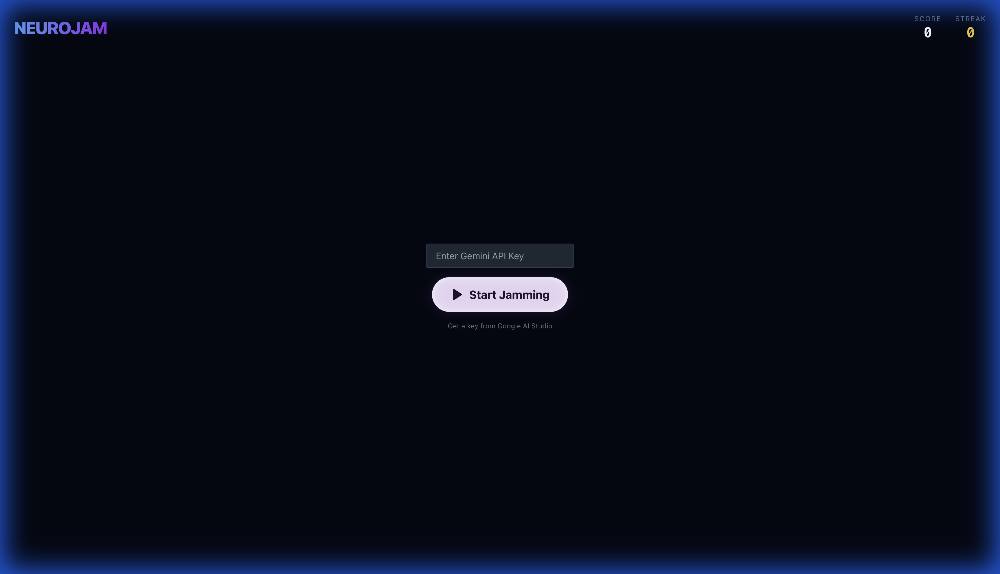
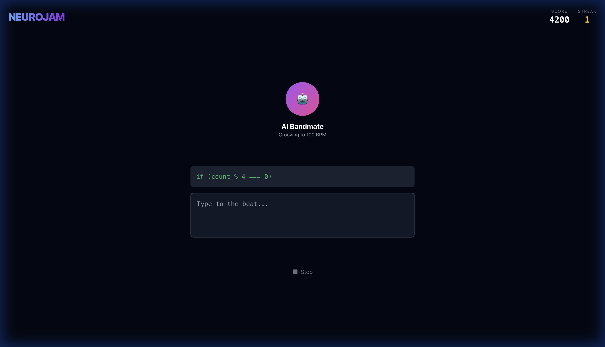

# NeuroJam

**NeuroJam** is a rhythm-based coding game where you type code to the beat of the music. It features an AI "Bandmate" that jams with you by generating the next line of code in real-time.




## Features

-   **Rhythm Coding**: Type code snippets to the beat (100 BPM).
-   **AI Bandmate**: Integrated with **Google Gemini API** (`gemini-2.5-flash`) to generate infinite coding levels.
-   **Scoring System**: Get points for staying on beat and typing correctly.
-   **Visuals**: Dynamic animations and feedback using Framer Motion.
-   **Audio**: Web Audio API (Tone.js) for precise timing and metronome.

## Tech Stack

-   **Frontend**: React, Vite, TypeScript
-   **Styling**: Tailwind CSS, Framer Motion, clsx
-   **State Management**: Zustand
-   **Audio**: Tone.js
-   **AI**: @google/genai SDK

## Getting Started

### Prerequisites

-   Node.js (v18+)
-   A Google Gemini API Key (Get one from [Google AI Studio](https://aistudio.google.com/))

### Installation

1.  Navigate to the client directory:
    ```bash
    cd client
    ```

2.  Install dependencies:
    ```bash
    npm install
    ```

3.  Start the development server:
    ```bash
    npm run dev
    ```

4.  Open `http://localhost:5173` in your browser.

5.  Enter your **Gemini API Key** when prompted to start jamming!

## How to Play

1.  **Listen**: Wait for the beat (4/4 time).
2.  **Type**: Type the code displayed in the green box.
3.  **Sync**: Try to hit keystrokes on the quarter notes for maximum points.
4.  **Jam**: Once you finish a line, the AI will generate the next one. Keep the flow going!

## License

MIT
